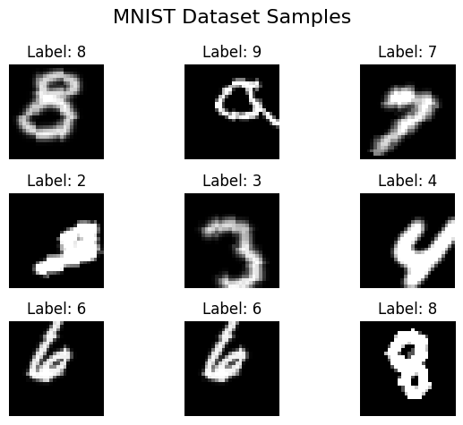
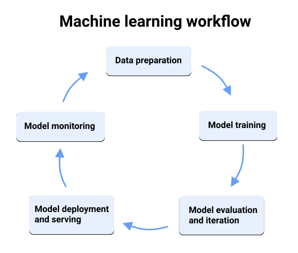

# Computer Vision Tutorial
This tutorial is designed to provide a hands-on introduction to the machine learning workflow using PyTorch. The focus is on building a simple Neural Network (NN) for image classification on the MNIST dataset, which consists of handwritten digits.

## MINIST Dataset Sample


## ML Workflow



## Setup
It is recommended to use Visual Studio Code or PyCharm to work with for this tutorial. 
Prerequisites:
- Python 3.8 or higher (3.11 is recommended) -> [Download Python](https://www.python.org/downloads/)
- Create a virtual environment (venv) to avoid package conflicts.
```bash
python -m venv ./venv
```
- Activate the virtual environment:
  - On Windows:
  ```bash
  .\venv\Scripts\activate
  ```
  - On MacOS/Linux:
  ```bash
  source ./venv/bin/activate
  ```
- Install the required packages using the command:
```bash
pip install -r requirements.txt
```

- Install Pytorch and torchvision the correct way for your system:
  [Pytorch Installation](https://pytorch.org/get-started/locally/) if a NVIDIA GPU and CUDA is installed use the CUDA version, however it is not part of the turtotial to setup CUDA and it is not required to run the tutorial. It simply speeds up the training process.

## Exercises
There are four notebooks, each covering a different concept:
- `(Intro)`&nbsp;[0_MNIST_Basic](0_MNIST_Basic.ipynb): A basic Feed-Forward Neural Network
- `(Turtorial) `&nbsp;[1_MNIST_Simple_CNN](1_MNIST_Simple_CNN.ipynb): Switches to a simple CNN
- `(Addendum)`&nbsp;[2_MNIST_Data_Augmentation](2_MNIST_Data_Augmentation.ipynb): Adds Data Augmentation
- `(Addendum)`&nbsp;[3_MNIST_Deeper_Model](3_MNIST_Deeper_Model.ipynb): Adds more layers to get a Deeper Model